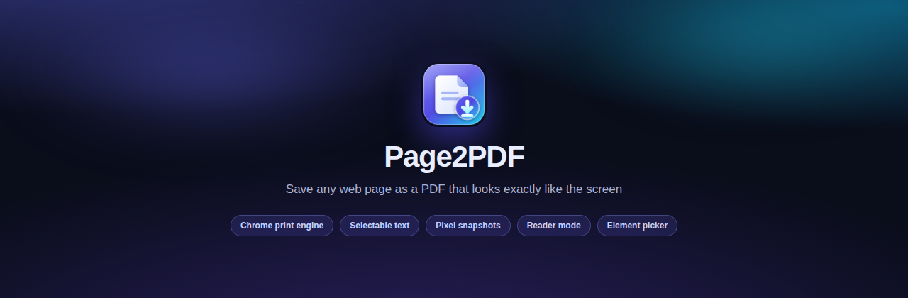

<p align="center">
  
</p>

<h1 align="center">Page2Copier</h1>

<p align="center">
  Save any web page as a PDF or clean standalone HTML that looks exactly like the screen.<br>
  Selectable text, working links, embedded styles, nothing cut off.
</p>

---

## Why version 2 exists

Version 1 used `html2canvas`, which reads your DOM and then repaints it with its
own partial reimplementation of CSS. Anything it does not implement is simply
lost: backdrop filters, blend modes, `position: sticky`, modern grid tricks,
canvas, cross origin images. That is where the weird layouts, the blank regions
and the missing content came from.

Version 2 throws all of that away. There is no rendering library in this
repository any more. Page2Copier now drives Chrome's own renderer through the
DevTools protocol, so the pixels and the text in the PDF come from the exact
same engine that painted the tab you are looking at. Furthermore, Page2Copier
includes built-in clean standalone HTML export that preserves CSS stylesheets,
form values, and images without runtime scripts.

## Two ways to capture

| | Text mode | Snapshot mode |
| --- | --- | --- |
| Engine | `Page.printToPDF`, the browser print pipeline | `Page.captureScreenshot`, the compositor |
| Text | Real, selectable, searchable | Rasterised |
| Links | Live | Live, added as PDF link areas |
| File size | Small, tens of kilobytes | Larger, one image per sheet |
| Best for | Articles, docs, receipts, invoices, anything you will search | Canvas, WebGL, maps, charts, blend modes, backdrop blur |

Text mode is the default, and it renders with **screen media emulation** rather
than print media. That single detail is why the output keeps the layout you were
actually looking at instead of a site's neglected print stylesheet.

## What it fixes

Most "page to PDF" tools fail in the same handful of ways. Each one is handled
before a single byte is rendered:

- **Content cut off at the right edge.** The layout is scaled so the full
  document width fits the sheet, rather than being sliced.
- **Half the page missing.** The document is scrolled end to end first so lazy
  loaders, infinite feeds and viewport triggered images all fire.
- **Images that never arrive.** Deferred images are forced eager and awaited,
  and web fonts are awaited too.
- **A cookie wall over every page.** Consent walls, chat bubbles, app install
  bars and newsletter overlays are removed.
- **A sticky header stamped on all forty sheets.** Pinned elements are unpinned
  so they appear once, in the flow, where they belong.
- **Panels showing only their first three lines.** Inner scroll areas are
  unrolled and collapsed `<details>` are opened.
- **Tables and code blocks split mid row.** Page breaks avoid cutting through
  images, tables, figures and preformatted blocks.

Every one of those changes is recorded and reverted the moment the capture is
written. The tab is left exactly as it was found, down to the style attributes.

## Features

**Capture**

- **Save Page as PDF**: whole page, in either text or snapshot mode.
- **Save Page as HTML**: export the entire page as a clean, self-contained HTML file with stylesheets inlined, canvas rendered to images, URLs absolutized, and scripts stripped for safe offline viewing.
- **Save Page as PNG**: capture full-page high-resolution PNG images with automatic multi-slice canvas stitching for tall pages.
- **Element picker (PDF, PNG & HTML)**: hover to outline a block, arrow keys to widen or narrow,
  press `M` to toggle between PDF, PNG, and standalone HTML mode, and click to save just that block.
  - In PDF mode, the sheet is cut to the block size.
  - In PNG mode, saves a crisp, cropped image of the selected element.
  - In HTML mode, extracts clean, standalone HTML with all computed styling, stylesheets, custom properties, form states, and asset URLs fully resolved.
- **Selection**: save only what you highlighted
- **Reader mode**: the article alone, in book typography, with a masthead
  carrying the title, site and date
- **Batch**: save every tab in the window into one dated folder
- **Linked pages**: right click any link to save its target without leaving the
  page you are on

**Output**

- A4, Letter, Legal, Tabloid, A3, A5, or a sheet cut to the page width
- Portrait or landscape, four margin presets
- One continuous sheet with no page breaks at all
- Header and footer with title, address, page numbers and date
- Light or dark theme forced through `prefers-color-scheme` emulation
- Custom layout width, for rendering a responsive site at desktop size
- Lossless or quality controlled snapshots, up to 4x resolution
- Clean standalone HTML exports with scripts sanitized and CSS embedded
- Full-page PNG exports with multi-slice stitching support

**Workflow**

- **Site presets**: any site can pin its own settings. Your docs site prints as
  a clean article, your dashboard as a pixel snapshot, and neither needs a
  second thought
- File name templates: `{title}`, `{domain}`, `{path}`, `{date}`, `{time}`
- Optional download subfolder
- `Alt+Shift+P` saves the page as PDF, `Alt+Shift+S` saves the page as HTML, `Alt+Shift+I` saves the page as PNG
- `Alt+Shift+E` opens element picker (press `M` in picker to cycle between PDF, PNG & HTML)
- Right click menu for page (PDF/HTML/PNG), selection, element (PDF/PNG/HTML), link and reader mode
- Progress shown in the page itself, so closing the popup does not lose it

## Install

**From source**

```bash
git clone https://github.com/guillesotelo/page2pdf.git
```

1. Open `chrome://extensions`
2. Turn on **Developer mode**
3. Click **Load unpacked** and choose the cloned folder

There is no build step. No bundler, no dependencies, no `node_modules`. What is
in the repository is what runs.

## About the debugger permission

Page2Copier asks for the `debugger` permission because that is the only way an
extension can reach `Page.printToPDF` and `Page.captureScreenshot`, the two
commands that make output match the screen. While a capture is running, Chrome
shows a "Page2Copier is debugging this browser" bar. It disappears the moment the
capture finishes, usually in a second or two.

The extension attaches only to the tab you asked it to save, only while it is
saving, and detaches in a `finally` block so a failure cannot leave the session
open. Nothing is read from any other tab.

## Privacy

Nothing leaves your machine. There is no server, no analytics, no telemetry and
no network request of any kind. Pages are rendered locally and files go
straight to your downloads folder. Settings and site presets live in
`chrome.storage.sync`, which is your own browser profile.

## Layout

```
manifest.json
icons/                     Toolbar and store icons
src/
  background/
    service-worker.js      Entry points, one capture per tab, progress, menus
    capture.js             The two capture pipelines
    cdp.js                 Promise wrapper around chrome.debugger
    prepare.js             Everything injected into the page before capture
    pdf-writer.js          Dependency free PDF assembly for snapshot mode
    settings.js            Defaults and per site presets
    download.js            File naming and saving
  content/
    picker.js              Element picker overlay
    hud.js                 In page progress pill
  ui/
    popup.html/.js         The popup
    options.html/.js       Settings
    glass.css              Shared design system
    offscreen.html/.js     Blob URL helper for downloads
store/                     Logo, tiles and store screenshots
```

The snapshot PDF writer is worth a look if you are curious: JPEG captures are
copied into the file as `DCTDecode` streams without being re-encoded, and
lossless captures go in as raw RGB under `FlateDecode` compressed with
`CompressionStream`. That is the whole of it, in roughly two hundred lines, with
no library.

## Known limits

- Chrome does not allow extensions on `chrome://` pages, the Web Store, or other
  extensions' pages. Nothing can be done about this from inside an extension.
- If DevTools is already open on a tab, the debugger cannot attach. Close it and
  retry.
- Batch capture uses text mode for background tabs, because a tab that is not
  being composited has no pixels to read.
- Pages taller than roughly 200 inches of PDF cannot be a single continuous
  sheet, which is a hard limit of the PDF format. They paginate instead.

## Support

If you find Page2Copier useful, you can support development on Ko-fi:

<a href='https://ko-fi.com/D4R428HJJJ' target='_blank'></a>

## Feedback

Issues and pull requests are welcome on
[GitHub](https://github.com/guillesotelo/page2pdf), or email
[guille.sotelo.cloud@gmail.com](mailto:guille.sotelo.cloud@gmail.com).

## Licence

MIT
